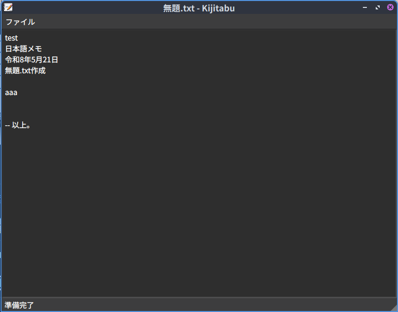

# Kijitabu
Kijitabuは[Qtライブラリ](https://www.qt.io/)を使用した軽量メモ帳アプリです。

# スクリーンショット

# 特徴
1. 軽量
2. 前回開いていたファイルをデフォルトでオープンします。
3. ファイル名を指定しない場合でも、一時ファイルに保存し次回起動時に続きから編集できます。

# 開発環境構築手順
1. sudo apt install qt6-base-dev

# ビルド手順
1. make build

# インストール手順
1. make install
